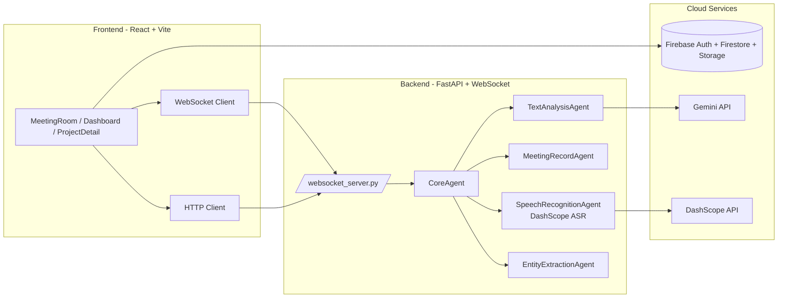
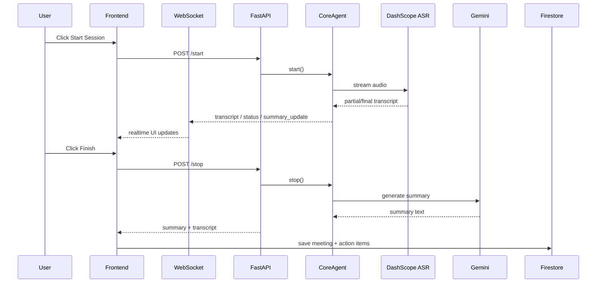

# MeetMind - AI-Powered Meeting Assistant

Real-time meeting transcription and intelligent analysis powered by AI.

## 项目结构

```
MeetMind-Unified/
├── backend/          # Python WebSocket 服务器（语音识别和AI分析）
├── frontend/         # React Web 应用
├── start.sh          # 一键启动脚本（同时启动前后端）
├── stop.sh           # 一键停止脚本
└── README.md         # 本文件
```

## 功能特性

### 后端 (Python + FastAPI + WebSocket)
- 🎙️ 实时语音识别（DashScope ASR）
- 📝 自动会议转录和说话人识别
- 🤖 AI 驱动的会议总结（Gemini API）
- ✅ 智能任务提取和实体识别
- 📄 PDF 文档上传和术语提取

### 前端 (React + TypeScript + Vite)
- 💬 实时转录显示
- 🌐 点击翻译功能（Gemini API）
- 📊 项目管理和组织
- 🔍 全局搜索
- 🔐 Firebase 认证和存储

## 系统架构图



## 编排说明（Orchestration）

- **编排中心**：`CoreAgent`
- **协作模式**：Hub-and-Spoke（中心调度） + 局部 Pipeline（实体提取 → 任务写入）
- **关键流程**：
	1. 前端点击 `Start Session` 调用 `POST /start`
	2. 后端启动 `CoreAgent`，打开麦克风流并连接 ASR
	3. 每条识别结果通过 WebSocket 推送到前端
	4. 按节奏触发摘要、关键词、实体抽取
	5. 前端点击 `Finish` 调用 `POST /stop`，后端返回 summary + transcript
	6. 前端写入 Firestore（meeting + actionItems）形成“会议记忆”

## 数据流图



## 快速开始

### 环境要求

- **Python**: 3.8+
- **Node.js**: 18+
- **系统**: macOS / Linux / Windows

### 1. 配置环境变量

#### 后端配置 (`backend/.env`)

```bash
# LLM Provider配置
LLM_PROVIDER=gemini

# Gemini API Configuration
GEMINI_API_KEY=your_gemini_api_key_here
GEMINI_MODEL_NAME=models/gemini-2.5-flash

# DashScope API Configuration (语音识别)
DASHSCOPE_API_KEY=your_dashscope_api_key
DASHSCOPE_ASR_MODEL_NAME=paraformer-realtime-v2
DASHSCOPE_LLM_MODEL_NAME=deepseek-r1

# Wake-up keyword
WAKE_UP_KEYWORD=凯丽同学
```

#### 前端配置 (`frontend/.env`)

```bash
# Gemini API
VITE_GEMINI_API_KEY=your_gemini_api_key_here

# Firebase Configuration
VITE_FIREBASE_PROJECT_ID=your-project-id
VITE_FIREBASE_APP_ID=your-app-id
VITE_FIREBASE_API_KEY=your-firebase-api-key
VITE_FIREBASE_AUTH_DOMAIN=your-project.firebaseapp.com
VITE_FIREBASE_FIRESTORE_DATABASE_ID=your-database-id
VITE_FIREBASE_STORAGE_BUCKET=your-project.firebasestorage.app
VITE_FIREBASE_MESSAGING_SENDER_ID=your-sender-id
```

### 2. 安装依赖

#### 后端依赖
```bash
cd backend
python -m venv .venv
source .venv/bin/activate  # Windows: .venv\Scripts\activate
pip install -r requirements.txt  # 如果没有 requirements.txt，依赖已在 .venv 中
```

#### 前端依赖
```bash
cd frontend
npm install
```

### 3. 启动项目

#### 方式一：使用一键启动脚本（推荐）
```bash
# 在项目根目录
./start.sh
```

#### 方式二：分别启动

**启动后端**（终端1）
```bash
cd backend
source .venv/bin/activate
python src/websocket_server.py
```

**启动前端**（终端2）
```bash
cd frontend
npm run dev
```

### 4. 访问应用

- **前端**: http://localhost:3000
- **后端 API**: http://localhost:8765
- **WebSocket**: ws://localhost:8765/ws

## 停止服务

```bash
./stop.sh
```

或手动按 `Ctrl+C` 停止各个服务。

## 使用说明

1. **登录**: 使用 Google 账号登录
2. **创建项目**: 在 Dashboard 创建新的会议项目
3. **开始会议**: 进入 Meeting Room，选择项目，点击开始录音
4. **实时转录**: 系统自动捕获语音并显示转录文本
5. **翻译**: 点击任意转录对话框的"Translate"按钮翻译为英文
6. **保存**: 停止录音后自动生成总结和任务项

## 技术栈

### 后端
- **框架**: FastAPI, Uvicorn
- **AI**: Google Gemini, DashScope ASR
- **语音**: PyAudio
- **数据处理**: LangChain, Jieba

### 前端
- **框架**: React 19, TypeScript
- **构建**: Vite
- **UI**: TailwindCSS, Motion (Framer Motion)
- **图标**: Lucide React
- **路由**: React Router
- **数据库**: Firebase Firestore
- **认证**: Firebase Auth

## 开发者：张典

- **项目**: MeetMind
- **类型**: Full-stack Meeting Assistant
- **许可**: MIT

## 故障排除

### 后端无法启动
- 检查 Python 虚拟环境是否激活
- 确认 `.env` 文件配置正确
- 检查端口 8765 是否被占用

### 前端白屏
- 检查 Firebase 配置是否正确
- 确认 Gemini API Key 已配置
- 查看浏览器控制台错误

### WebSocket 连接失败
- 确保后端服务已启动
- 检查防火墙设置
- 确认 URL 为 `ws://localhost:8765/ws`

## 更新日志

### v1.0.0 (2026-05-09)
- ✨ 初始版本发布
- 🎯 前后端项目统一整合
- 🌐 添加实时翻译功能
- 🔧 优化项目结构

---
